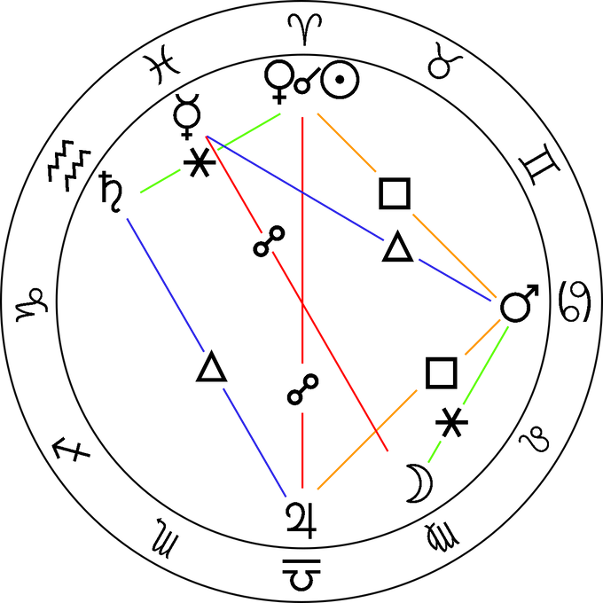

#  Planetary combination in Vettius Valens


This is a folder with scripts and data to analyse aspects of the astrological theories of the 2nd century Hellenistic astrologer Vettius Valens.

See the associated paper for more information:

C. S. Hall \& L. P. Shaw. The internal logic of planetary combination in Vettius Valens (2022). [pdf](link_to_be_added)

## Background

In Book I of the *Anthology* ([pdf](http://www.csus.edu/indiv/r/rileymt/Vettius%20Valens%20entire.pdf) trans. Mark Riley), Vettius Valens gives lists of predictions associated with planets and combinations of planets (doubles and then triples). Here, we analyse the internal consistency of these predictions. 

## Details

The file `Valens-database.csv` contains assessments of all lexical terms used in descriptions of planetary combinations and an assessment of the term as bad/neutral/good. Alternatively: negative(n)/neutral(m)/positive(p). This database is then used to calculate the overall sentiment of each description `S=(p-n)/(p+m+n)`. We then analyse how consistent these sentiments are using different models. 
 
Figures and analysis can be reproduced by running `Reproduce-paper-analysis.R` (from within `analysis/R`). 

There is also some extra analysis, including looking at real horoscopes from 1-200 CE to see how frequently combinations occur, some mathematical analysis of occurrences of aspects compared to random combinations, and an application of an existing NLP sentiment classifier to English text descriptions. 

Texts are available (Greek - Pingree; English - Riley translation) in `data/texts`. 

### Repository structure

```
data - raw data 
figures - versions of figures from the manuscript
analysis
	R - R scripts (models of sentiment)
    	python - python (calculation of Z-codes)
        intermediate-files - files made during analysis process
```

